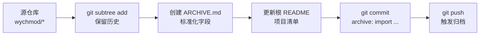

<div align="center">

# 🗄️ Archiving Project

**A curated archive of personal side projects, learning experiments, and retired codebases.**

*集中即索引 · 保真优先 · 状态透明*

<br/>


<br/>

> 一个集中沉淀个人 GitHub 历史学习项目、练手项目和不再单独维护旧项目的归档仓库。
> 每一份归档都能回答三个问题:**它是什么 · 为什么保留 · 现在还活着吗**。

[📦 项目清单](#-项目清单) · [📊 技术栈分布](#-技术栈分布) · [🕒 归档时间线](#-归档时间线) · [📥 归档工作流](#-归档工作流) · [🤖 面向 AI Agent](#-面向-ai-agent)

</div>

---

## 📖 关于本仓库

`archiving-project` 是一个**纯归档仓库**(archive-only repository)—— 把所有"不再单独维护、但仍有学习与参考价值"的历史项目集中沉淀到一个可检索的索引下。

这里**不追求数量**,而是追求**每一份归档都能回答关于自身的关键问题**。默认状态下,所有子目录中的代码处于**只读快照**模式,提交历史通过 `git subtree` 完整保留,可逐 commit 回溯。

### 它解决什么问题

- 🔍 **可检索** —— 未来翻找某段历史代码时,不再需要在几十个分散的 GitHub 仓库中大海捞针
- 🧬 **可对照** —— 把不同语言 / 框架 / 架构风格的尝试并列存放,形成技术演化的化石标本
- 🛡️ **可托底** —— 集中管理,降低历史项目散落带来的凭据泄露与归档丢失风险
- 🤖 **可协作** —— 配套 AI Agent 规范文件,让自动化工具在改动前先理解约定

### 它不是什么

- ❌ 不是个人作品集主站(请移步个人 profile 仓库)
- ❌ 不是持续维护的开发项目(归档默认只读)
- ❌ 不是教程合集(每个子项目独立的 `ARCHIVE.md` 才是检索入口)

---

## ✨ 仓库特性

| 特性 | 说明 |
| --- | --- |
| 🗂️ **9 个归档项目** | 横跨 7+ 个技术栈,涵盖 LLM 应用、全栈练手、企业中台、运维工具与医疗系统 |
| 📜 **保留原始历史** | 全部通过 `git subtree` 迁入,提交链可逐 commit 回溯 |
| 🔐 **凭证已脱敏** | 涉及真实密钥 / Token 的项目在导入时已做安全处理(详见 [🔐 安全声明](#-安全声明)) |
| 🤖 **AI Agent 友好** | 配套 [`AGENTS.md`](./AGENTS.md) + [`CLAUDE.md`](./CLAUDE.md),自动化工具有规可循 |
| 📐 **统一元数据** | 每个子项目都有 `ARCHIVE.md`,字段标准化,可被脚本批量解析 |
| 🪶 **零构建依赖** | 纯 Markdown + 源代码快照,无需任何 CI / build 工具链即可阅读 |
| 🌍 **跨文档一致** | `README.md` / `AGENTS.md` / `CLAUDE.md` 三者职责分明、联动可追溯 |

---

## 📦 项目清单

> 按**场景用途**分组,而非按字母序。每行末尾的徽标告诉你它在四象限中的定位。

### 🟦 AI / LLM 应用

| 项目 | 简介 | 技术栈 | 状态 |
| --- | --- | --- | --- |
| [**ChatGPT-Next-Web**](./archived-projects/ChatGPT-Next-Web) | 跨平台私人 ChatGPT Web UI,支持一键部署、PWA、桌面客户端、本地会话存储和多语言界面 | `Next.js` · `React` · `TypeScript` · `Sass` · `Zustand` · `Tauri` · `Docker` · `Vercel` | 已归档 |

### 🟩 全栈练手

| 项目 | 简介 | 技术栈 | 状态 |
| --- | --- | --- | --- |
| [**ToDoList**](./archived-projects/ToDoList) | 待办事项全栈练习项目,Django + React,支持 CRUD、优先级、到期时间与排序 | `Python` · `Django` · `DRF` · `React` · `React Bootstrap` · `Webpack` | 已归档 |
| [**1802axf (爱先蜂)**](./archived-projects/1802axf) | Django 课设项目,O2O 闪送超市 Demo,含主页 / 闪送超市 / 购物车 / 我的四大模块,支持登录注册、商品分类、购物车与下单 | `Python` · `Django 1.11.4` · `SQLite` · `jQuery` · `Bootstrap` · `Swiper` | 已归档 |
| [**bolg (博客)**](./archived-projects/bolg) | Flask 全栈博客练手项目,应用工厂模式,含注册激活、文章 CRUD、个人中心、收藏、搜索、分页与文件上传 | `Python` · `Flask` · `Flask-Login` · `Flask-SQLAlchemy` · `Flask-Migrate` · `Flask-WTF` · `Jinja2` · `SQLite` | 已归档 |

### 🟨 企业级 / 中台架构

| 项目 | 简介 | 技术栈 | 状态 |
| --- | --- | --- | --- |
| [**wiki (知识库)**](./archived-projects/wiki) | 全栈知识库 / 文档管理系统,Spring Boot + Vue 3 + Ant Design Vue,以「电子书 → 分类 → 文档」三层结构组织内容,支持富文本编辑、树形分类、文档点赞、WebSocket 实时通知、阅读量统计与定时快照 | `Java 8` · `Spring Boot 2.4` · `MyBatis` · `MySQL 8` · `Redis` · `WebSocket` · `PageHelper` · `Vue 3` · `TypeScript` · `Ant Design Vue` · `wangEditor` | 已归档 |
| [**Lottery (抽奖系统)**](./archived-projects/lottery) | DDD 四层架构 + Spring Boot + Dubbo RPC + 自研分库分表中间件的完整抽奖系统,含抽奖策略 / 活动 / 奖品三大领域 + ID 生成器 + `dbRouter` 注解路由;配套 4 章笔记 + SQL + XMind + PPT + Excel 教学资料 | `Java 8` · `Spring Boot 2.3` · `MyBatis` · `Dubbo 2.6` · `ZooKeeper` · `MySQL` · `Redis` · `JSP` | 已归档 |
| [**cloud-short-link (云短链接)**](./archived-projects/cloud-short-link) | 基于 Spring Cloud Alibaba 的云原生短链生成与管理系统,8 个 Maven 模块(`account` / `link` / `data` / `gateway` / `shop` / `app` / `common` / `short-link`),MurmurHash32 + Base62 + Sharding-JDBC 自研分库分表策略,JWT 鉴权 + 阿里云 OSS / 短信 + Redisson 分布式锁 + XXL-Job | `Java 11` · `Spring Boot 2.5` · `Spring Cloud 2020` · `Spring Cloud Alibaba 2021` · `Nacos` · `MyBatis Plus` · `Sharding-JDBC` · `JWT` · `Redisson` · `XXL-Job` · `阿里云 OSS` | 已归档 |

### 🟪 工具 / 垂直领域系统

| 项目 | 简介 | 技术栈 | 状态 |
| --- | --- | --- | --- |
| [**huawei-alarm (华为云告警机器人)**](./archived-projects/huawei-alarm) | 华为云 AOM 告警 → 飞书机器人的 webhook 通知桥,FastAPI 接收 SMN 推送、解析告警 JSON、按 `chat_type` 分发到飞书群或私聊,支持 `interactive` / `text` 两种消息卡片模板 | `Python 3` · `FastAPI` · `SQLAlchemy` · `PostgreSQL` · `Pydantic` · `requests` · `飞书 OpenAPI` | 已归档(已脱敏) |
| [**ascvd (心血管风险评估系统)**](./archived-projects/ascvd) | ASCVD 动脉粥样硬化性心血管疾病风险评估与报告系统,Django + DRF + MySQL 后端,React + MobX + Ant Design + React Flow 前端,7 个 Apps 涵盖患者档案 / 血脂亚组分 / 基因多态性 / 疾病字典等 | `Python 3.8` · `Django 4.1` · `DRF 3.13` · `MySQL 8` · `React 18` · `MobX 6` · `Ant Design 4` · `React Flow 11` · `TyAdmin` · `uWSGI` | 已归档(已脱敏 + README 升级) |

> 完整归档规范、提交规范与禁止动作见 [`AGENTS.md`](./AGENTS.md)。

---

## 📊 技术栈分布

> 一图看清这个仓库的语言 / 框架覆盖度。所有计数按子项目粒度统计,同一项目出现多个技术栈时会重复计入对应行。

### 按后端语言

| 语言 | 项目数 | 代表项目 |
| --- | ---: | --- |
| 🐍 **Python** | 5 | ToDoList · 1802axf · bolg · huawei-alarm · ascvd |
| ☕ **Java** | 4 | wiki · Lottery · cloud-short-link · (ChatGPT-Next-Web 的 Next.js 后端 API 路由) |
| 🌐 **TypeScript / JavaScript** | 5 | ChatGPT-Next-Web · ToDoList(前端) · wiki(前端) · ascvd(前端) · cloud-short-link(网关) |

### 按前端栈

| 框架 / 库 | 项目数 | 代表项目 |
| --- | ---: | --- |
| ⚛️ **React** | 4 | ChatGPT-Next-Web · ToDoList · ascvd · wiki(类 React 范式) |
| 🟢 **Vue 3** | 1 | wiki |
| 🎨 **jQuery** | 1 | 1802axf |
| 🖼️ **Jinja2 模板** | 1 | bolg |
| 🅰️ **Ant Design / Ant Design Vue** | 2 | wiki · ascvd |

### 按架构风格

| 风格 | 项目数 | 代表项目 |
| --- | ---: | --- |
| 🧱 **经典 MVC / MVT** | 4 | ToDoList · 1802axf · bolg · wiki |
| 🧬 **DDD 四层架构** | 1 | Lottery |
| ☁️ **微服务 / Spring Cloud Alibaba** | 1 | cloud-short-link |
| ⚡ **Serverless / Webhook 桥** | 1 | huawei-alarm |
| 📦 **SPA + REST** | 2 | ascvd · ChatGPT-Next-Web |

---

## 🕒 归档时间线

> 按 `git log` 中 `archive:` 前缀的提交顺序倒序排列,作为仓库成长史的一瞥。

```
2026-06-28  ┃  ★ cloud-short-link     (Spring Cloud Alibaba 云短链)
2026-06-28  ┃  ★ ascvd                (心血管风险评估 · 已脱敏)
2026-06-28  ┃  ★ huawei-alarm         (华为云告警 → 飞书 · 已脱敏)
2026-06-25  ┃  ★ Lottery              (DDD + Dubbo 抽奖系统 · re-import)
2026-06-25  ┃  ★ wiki                 (Spring Boot + Vue 3 知识库)
2026-06-25  ┃  ★ bolg                 (Flask 全栈博客)
2026-06-XX  ┃  ★ ChatGPT-Next-Web     (LLM Web UI 首次归档)
2026-06-XX  ┃  ★ ToDoList             (Django + React 待办)
2026-06-XX  ┃  ★ 1802axf              (Django O2O 课设)
```

---

## 🗂️ 目录结构

```
archiving-project/
├── README.md                          # 本文件 · 项目门面
├── AGENTS.md                          # 通用 AI Agent 操作规范(权威源)
├── CLAUDE.md                          # Claude / Anthropic 系 agent 补充偏好
└── archived-projects/                 # 历史归档项目(默认只读快照)
    ├── ChatGPT-Next-Web/              # ARCHIVE.md · 跨平台 ChatGPT Web UI
    ├── ToDoList/                      # ARCHIVE.md · Django + React 待办事项
    ├── 1802axf/                       # ARCHIVE.md · Django 课设 O2O 闪送超市
    ├── wiki/                          # ARCHIVE.md · Spring Boot + Vue 知识库
    ├── bolg/                          # ARCHIVE.md · Flask 全栈博客
    ├── lottery/                       # ARCHIVE.md · DDD + Dubbo 抽奖系统
    ├── huawei-alarm/                  # ARCHIVE.md · FastAPI 华为云告警 → 飞书(已脱敏)
    ├── ascvd/                         # ARCHIVE.md · Django + React 心血管风险评估(已脱敏)
    └── cloud-short-link/              # ARCHIVE.md · Spring Cloud Alibaba 云短链接(已脱敏)
```

---

## 📥 归档工作流

> 把新项目迁入此仓库的标准流程。任何 AI Agent 在执行迁入前**必须**先读完 [`AGENTS.md`](./AGENTS.md) §3。

### 流程图



### 五步走

| 步骤 | 动作 | 关键点 |
| :---: | --- | --- |
| **1** | **确认分类** | 目标目录固定为 `archived-projects/<name>/`,本仓库只承担历史项目归档职责 |
| **2** | **拉取代码** | 使用 `git subtree add`,**保留原始 commit 历史**;不要 `clone + 复制粘贴` |
| **3** | **写 `ARCHIVE.md`** | 在子项目根目录新建,字段参考 `AGENTS.md` §2.2(名称 / 简介 / 技术栈 / 学习重点 / 状态 / 来源) |
| **4** | **更新根 README** | 在「项目清单」表格中追加一行,并按场景分组;若涉及真实凭证,在简介中显式标注「已脱敏」 |
| **5** | **提交并推送** | commit message 遵循 Conventional Commits:`archive: import <project-name> from <source-url>` |

---

## 🔐 安全声明

本仓库虽为归档仓库,但部分项目曾涉及**真实的外部服务凭证**(云厂商 AccessKey、数据库密码、第三方 Token 等)。在导入时已逐项按以下原则处理:

| 场景 | 处理方式 |
| --- | --- |
| 配置文件中的密钥 / Token | 替换为占位符(如 `<YOUR_ACCESS_KEY>` / `<YOUR_DB_PASSWORD>`),保留结构 |
| README 中的部署截图 | 涉及敏感信息的图片已脱敏或删除 |
| 代码中硬编码的 IP / 域名 | 已替换为示例地址 |
| 原始 `.env` / 凭证文件 | **不会**随归档一并导入,需用户自行在本地按 `.env.example` 重建 |

> 如发现仍有遗漏的敏感信息,**请勿直接开 public issue**,可通过 private advisory 或邮件告知 owner。

当前已确认完成脱敏的项目:

- ✅ `huawei-alarm` —— INI 配置文件中的真实凭证已脱敏
- ✅ `ascvd` —— 凭证已脱敏,并对 `README.md` 做了企业级重写
- ✅ `cloud-short-link` —— 凭证已脱敏

---

## 🤖 面向 AI Agent

本仓库配备面向 AI agent 的协作文件,用于让自动化工具(代码助手、检索 agent、迁移脚本等)在改动前**先理解约定再动手**:

| 文件 | 读者 | 职责 |
| --- | --- | --- |
| [`AGENTS.md`](./AGENTS.md) | 所有 `AGENTS.md` 消费者(OpenCode / Codex / Cursor / Devin / Aider / Gemini CLI 等) | 权威规范源:目录约定、字段模板、提交规范、禁止动作 |
| [`CLAUDE.md`](./CLAUDE.md) | Anthropic 系 agent(Claude Code 等) | 在 `AGENTS.md` 基础上的额外偏好补充 |

**冲突优先级**:`AGENTS.md` > `CLAUDE.md` > `README.md`。修改任一份文档时,必须同步检查并按需更新另外两份(详见 `AGENTS.md` §0)。

### 信息查询速查表

| 想做什么 | 看哪里 |
| --- | --- |
| 这个仓库是什么 / 怎么归档 | 本文件 + [`AGENTS.md`](./AGENTS.md) §1-§5 |
| 某个归档项目的用途与状态 | `archived-projects/<name>/ARCHIVE.md` |
| Claude 特别要做的事 | [`CLAUDE.md`](./CLAUDE.md) |
| 仓库目前归档了哪些 | 本文件「[项目清单](#-项目清单)」 |
| 技术栈覆盖情况 | 本文件「[技术栈分布](#-技术栈分布)」 |

---

## 📜 License

本仓库根目录采用 **MIT License**。归档项目各自的 License 沿用其原始仓库声明,详见各子项目目录中的 `LICENSE` 文件(若有)。

```
MIT License

Copyright (c) wychmod

Permission is hereby granted, free of charge, to any person obtaining a copy
of this software and associated documentation files (the "Software"), to deal
in the Software without restriction, including without limitation the rights
to use, copy, modify, merge, publish, distribute, sublicense, and/or sell
copies of the Software, and to permit persons to whom the Software is
furnished to do so, subject to the following conditions:

The above copyright notice and this permission notice shall be included in all
copies or substantial portions of the Software.
```

---

<div align="center">

**🗄️ Archiving Project** · *A single source of truth for code that shaped the way I build.*

<sub>Built with Markdown + Git · Designed for humans and AI agents alike · Maintained by [wychmod](https://github.com/wychmod)</sub>

</div>