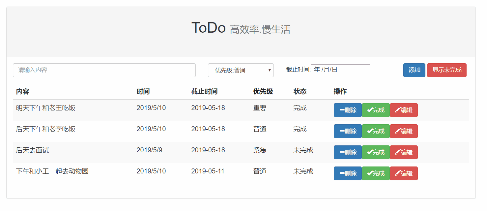
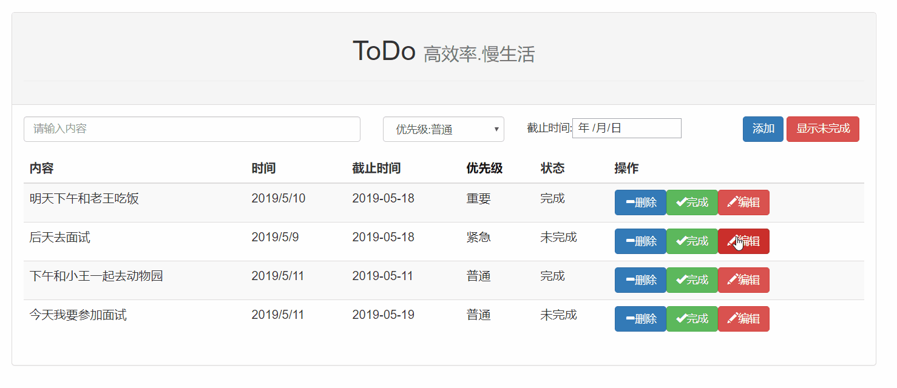
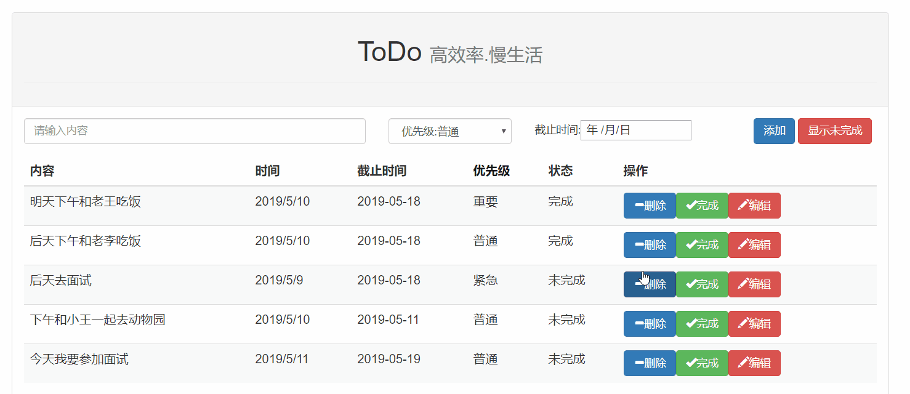
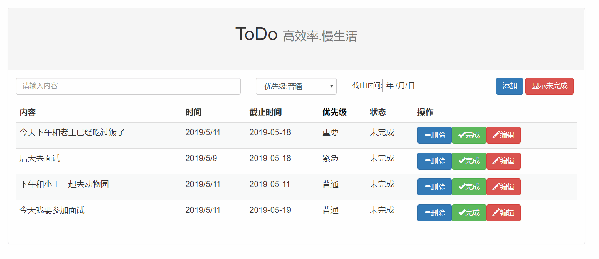
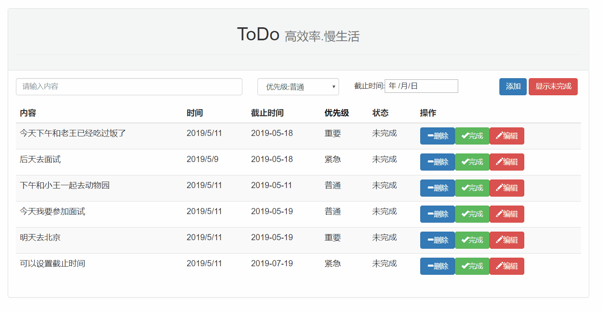
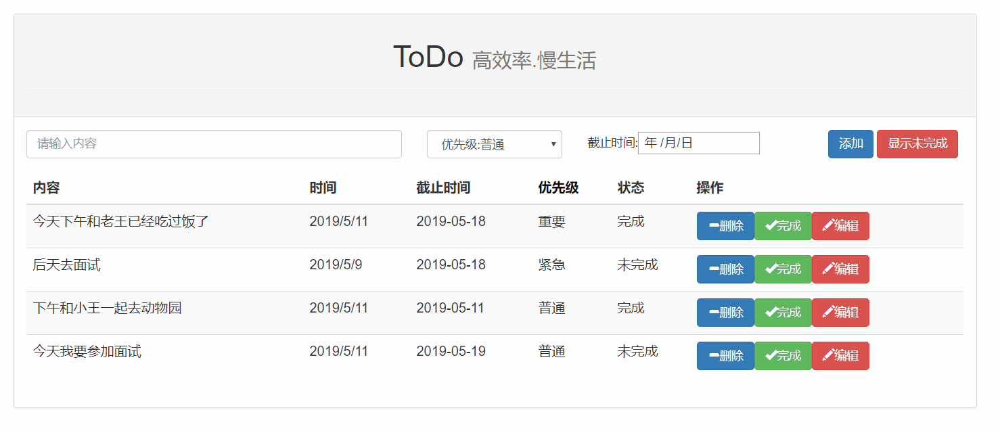

<div align="center">

# ✅ ToDoList

### Django + React 前后端分离的待办事项管理系统

[](#-归档状态)
[](https://www.python.org)
[](https://www.djangoproject.com)
[](https://react.dev)
[](https://react-bootstrap.github.io)
[](https://webpack.js.org)

**一个"麻雀虽小五脏俱全"的前后端分离练手项目:DRF 提供 RESTful 接口,React + Bootstrap 构建交互界面,完整覆盖待办事项的增删改查、优先级、到期时间与排序。**

[功能](#-核心功能) · [技术栈](#-技术栈) · [快速开始](#-快速开始) · [结构](#-项目结构) · [归档状态](#-归档状态)

</div>

---

## 📑 目录

- [项目概述](#-项目概述)
- [核心功能](#-核心功能)
- [功能演示](#-功能演示)
- [技术栈](#-技术栈)
- [项目结构](#-项目结构)
- [快速开始](#-快速开始)
- [学习价值](#-学习价值)
- [归档状态](#-归档状态)
- [License](#-license)

---

## 📖 项目概述

ToDoList 是一个 2019 年的前后端分离练手项目,由 **Django + Django REST Framework** 后端与 **React + React Bootstrap** 前端组成,围绕"待办事项"这一最小业务闭环,完整实践了从 ORM 建模、序列化接口,到前端组件化、Webpack 构建的全链路开发。

| 维度 | 说明 |
| --- | --- |
| **产品形态** | SPA 前端(React)+ RESTful API(Django) |
| **核心场景** | 个人待办管理:录入、编辑、完成标记、优先级、到期提醒 |
| **交互亮点** | 按优先级排序、到期时间(expire date)管理 |
| **项目年代** | 2019-05(React 16.8 / Webpack 3 时代) |
| **最佳用途** | 前后端分离入门范本 / 历史技术栈对照样本 |

---

## ✨ 核心功能

| 模块 | 能力 |
| --- | --- |
| ➕ **待办管理** | 新增 / 删除 / 编辑待办事项 |
| ☑️ **完成标记** | 一键标记待办为已完成 |
| 🔥 **优先级** | 为待办设置优先级,并支持按优先级排序 |
| ⏰ **到期时间** | 为待办设置 expire date |
| 📋 **列表展示** | 列出所有待办事项 |

---

## 🎬 功能演示

以下演示图均为项目 `image/` 目录中的真实录屏:

| 功能 | 演示 |
| --- | --- |
| 添加待办事项 |  |
| 编辑待办事项 |  |
| 删除待办事项 |  |
| 标记完成 |  |
| 设置优先级 |  |
| 按优先级排序 |  |
| 设置到期时间 |  |
| 列出所有待办 |  |

---

## 🧱 技术栈

### 前端(`ToDoListReact/`)

| 类别 | 选型 | 版本 | 用途 |
| --- | --- | --- | --- |
| UI 框架 | React | ^16.8.0 | 组件化界面(引入 Hooks 的首个稳定版本) |
| 组件库 | React Bootstrap | ^1.0.0-beta.8 | Bootstrap 4 的 React 实现 |
| 样式 | Bootstrap | ^4.3.1 | 基础样式系统 |
| 路由 | React Router | ^5.0.0 | SPA 路由 |
| 构建 | Webpack | ^3.12.0(dev) / ^1.13.2(dep) | 模块打包与 dev-server |
| 编译 | Babel(babelify / babel-preset-react) | ^6.x / ^7.x | JSX 与 ES2015 转译 |
| 数据请求 | fetch | ^1.1.0 | 调用后端 REST API |

### 后端(`ToDoListDjango/`)

| 类别 | 选型 | 用途 |
| --- | --- | --- |
| 语言 | Python 3 | 主开发语言 |
| Web 框架 | Django | ORM / 视图 / 路由 |
| API 框架 | Django REST Framework | 待办事项的序列化与 RESTful 接口 |

> 后端未附带依赖锁定文件;依赖版本以 2019 年当时的 Django / DRF 稳定版为准,如需运行请自行准备环境。

---

## 📂 项目结构

```
ToDoList/
├── README.md               # 本文件
├── ARCHIVE.md              # 归档档案
├── image/                  # 功能演示 GIF(见上方功能演示)
│
├── ToDoListDjango/         # Django 后端
│   ├── manage.py           # Django 命令行入口
│   ├── ToDoList/           # 项目配置( settings / urls )
│   └── App/                # 待办事项业务应用( models / views )
│
└── ToDoListReact/          # React 前端
    ├── package.json
    ├── webpack.config.js   # Webpack 构建配置
    ├── index.html          # SPA 入口页
    └── src/                # 组件 / 逻辑源码
```

---

## 🚀 快速开始

> ⚠️ **归档快照**:项目年代较早(2019),依赖版本已停止维护,以下步骤仅供历史参考;如需真正运行,建议先单独整理依赖版本。

```bash
# 1) 后端
cd ToDoListDjango
pip install django djangorestframework django-cors-headers django-crispy-forms
python manage.py migrate
python manage.py runserver       # 默认 http://127.0.0.1:8000

# 2) 前端(新终端)
cd ToDoListReact
npm install
# 注意:package.json 未定义启动脚本,仅声明了 test;
# 历史用法为直接调起 devDependencies 中的 webpack 工具链:
npx webpack-dev-server           # 或 npx webpack 打包后部署 index.html
```

---

## 💡 学习价值

- **前后端分离的最小完整闭环**:一个资源(Todo)从 Model → Serializer → ViewSet → fetch 调用 → 组件渲染的全链路实现
- **React 16.8 时代的组件写法**:与当下 Hooks 生态形成历史对照
- **Webpack 3 手工配置**:对比如今 Vite / CRA 脚手架,理解打包器到底做了什么
- **React Bootstrap 组件化 UI**:Bootstrap 4 与 React 组件体系的结合方式
- **CRUD 之外的细节**:优先级排序、到期时间这类"业务字段"如何贯穿前后端

---

## 🗄️ 归档状态

| 项 | 内容 |
| --- | --- |
| 原仓库 | `git@github.com:wychmod/ToDoList.git` |
| 归档日期 | 2026-06-23 |
| 快照基线 | 2019-05-13 "Add files via upload" |
| 当前状态 | **已归档,只读快照**,仅保留源码和历史学习参考 |

详细档案见 [`ARCHIVE.md`](./ARCHIVE.md)。

---

## 📜 License

原仓库未附带 LICENSE 文件。本项目仅用于学习与历史归档参考。
