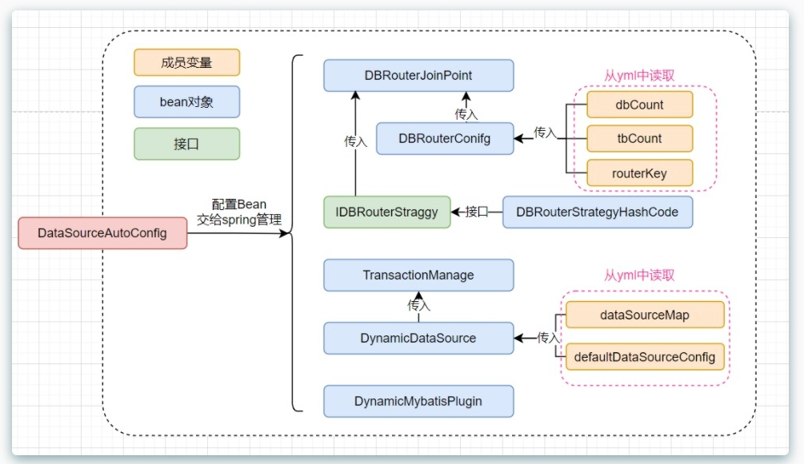
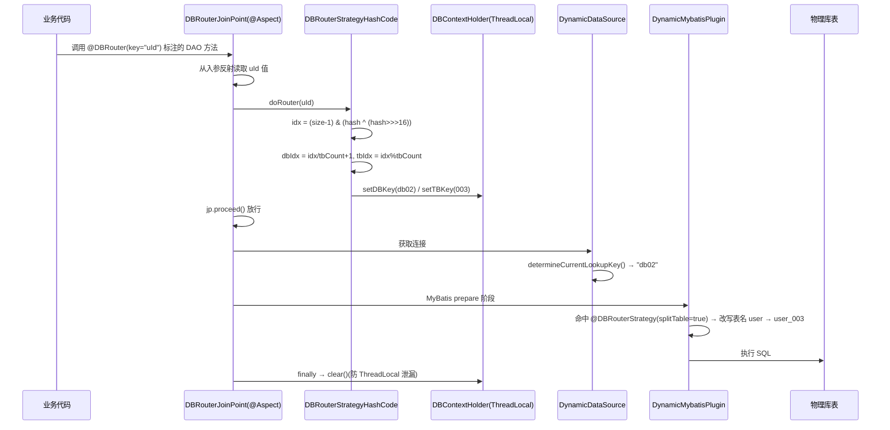

<div align="center">

# 🧭 db-router-springboot-starter

### 注解式分库分表路由中间件 · Spring Boot Starter

[](#-归档状态)
[](https://www.java.com)
[](https://spring.io)
[](https://mybatis.org)
[](https://www.mysql.com)

**把 JDK HashMap 的核心设计原理搬进分库分表:哈希散列 + 扰动函数均匀路由,`@DBRouter` 一个注解完成动态数据源切换与 SQL 表名改写——一个约 400 行、可完整读透的自研中间件。**

[能力](#-核心能力) · [架构](#️-工作原理) · [使用](#-快速开始) · [配置](#️-配置项) · [设计亮点](#-设计亮点) · [归档状态](#-归档状态)

</div>

---

## 📑 目录

- [项目概述](#-项目概述)
- [核心能力](#-核心能力)
- [工作原理](#️-工作原理)
- [技术栈](#-技术栈)
- [项目结构](#-项目结构)
- [快速开始](#-快速开始)
- [配置项](#️-配置项)
- [设计亮点](#-设计亮点)
- [已知限制](#️-已知限制)
- [归档状态](#-归档状态)
- [License](#-license)

---

## 📖 项目概述

`db-router-springboot-starter` 是一个以 **Spring Boot Starter** 形态交付的注解式分库分表路由中间件。业务代码只需在 DAO 方法上标注 `@DBRouter(key = "uId")`,中间件即完成:

1. **分库** —— AOP 切面读取入参中的路由字段,经扰动哈希计算目标库,通过 `DynamicDataSource` 自动切换数据源
2. **分表** —— MyBatis 拦截器拦截 SQL,将逻辑表名改写为带后缀的物理表名(如 `user` → `user_003`)

它是归档仓库中 [Lottery 抽奖系统](../lottery/README.md) 所依赖的 `com.wychmod:db-router-springboot-starter:1.0-SNAPSHOT` 的本体——**"自研中间件 + 业务消费方"在同一归档内构成完整闭环**。

| 维度 | 说明 |
| --- | --- |
| **产品形态** | Spring Boot Starter(jar,`spring.factories` 自动装配) |
| **路由模型** | `dbCount × tbCount` 库表矩阵,哈希散列 + 扰动函数均匀分布 |
| **业务侵入** | 零侵入:注解声明,无需改动 SQL 与业务逻辑 |
| **代码体量** | 主代码 13 个类,约 400 行,可完整读透 |
| **最佳用途** | Spring Boot Starter 开发范式 / 分库分表原理 / AOP + MyBatis 插件机制的学习样本 |

---

## ✨ 核心能力

| 模块 | 能力 |
| --- | --- |
| 🎯 **`@DBRouter` 注解路由** | 类/方法级注解,`key` 指定路由字段;未指定时回退全局 `routerKey` 配置 |
| 🗂️ **`@DBRouterStrategy(splitTable)`** | DAO 级分表标记,仅对标记类触发 SQL 表名改写 |
| 🔀 **扰动哈希路由** | `(size - 1) & (hash ^ (hash >>> 16))`,复用 JDK HashMap 的散列思想,均匀分布到库表矩阵 |
| 🔄 **动态数据源切换** | `DynamicDataSource`(AbstractRoutingDataSource)按 ThreadLocal 中的 `db{idx}` 切换 |
| ✂️ **SQL 表名改写** | MyBatis `StatementHandler.prepare` 拦截器,正则捕获 from/into/update 首表名并追加分表后缀 |
| 🧵 **ThreadLocal 上下文** | `DBContextHolder` 传递 dbKey/tbKey,切面 `finally` 强制清理,防内存泄漏 |
| 💱 **事务支持** | 自动装配 `TransactionTemplate`(`PROPAGATION_REQUIRED`) |
| 🔌 **零配置装配** | `spring.factories` + `@ConditionalOnMissingBean`,引入即用、可替换扩展 |

---

## 🏗️ 工作原理

### 类图(Bean 装配关系)



### 请求时序



---

## 🧱 技术栈

| 类别 | 选型 | 版本 | 用途 |
| --- | --- | --- | --- |
| 语言 | Java | 8 | 主开发语言 |
| 框架 | Spring Boot(parent) | 2.3.5.RELEASE | starter 基座 |
| 自动装配 | spring-boot-autoconfigure + spring.factories | 随 parent | `DataSourceAutoConfig` 入口 |
| 切面 | Spring Boot Starter AOP | 随 parent | `@Aspect` 拦截 `@DBRouter` |
| ORM | MyBatis Spring Boot Starter | 2.1.4 | Plugin 拦截器机制 |
| 数据库 | MySQL Connector | 8.0.23 | 驱动 |
| 事务 | Spring JDBC(TransactionTemplate) | 随 parent | 事务模板装配 |
| 工具 | commons-beanutils / commons-lang / fastjson | 1.9.4 / 2.6 / 1.2.75 | 入参属性反射读取等 |
| 测试 | JUnit | 4.12 | ApiTest |

---

## 📂 项目结构

```
db-router-springboot-starter/
├── pom.xml                          # 1.0-SNAPSHOT,附加 source jar,配置提示 processor
├── img/
│   ├── img.png                      # 类图(Bean 装配关系)
│   └── img_1.png                    # 时序图
├── src/main/java/com/wychmod/middleware/db/router/
│   ├── DBRouterJoinPoint.java       # 切面:读路由键 → 策略路由 → 放行 → finally 清理
│   ├── DBContextHolder.java         # ThreadLocal(dbKey / tbKey)
│   ├── DBRouterConfig.java          # dbCount / tbCount / routerKey
│   ├── annotation/
│   │   ├── DBRouter.java            # 路由注解
│   │   └── DBRouterStrategy.java    # 分表标记注解
│   ├── config/
│   │   └── DataSourceAutoConfig.java # EnvironmentAware:解析 yml,装配全部 Bean
│   ├── dynamic/
│   │   ├── DynamicDataSource.java   # AbstractRoutingDataSource 实现
│   │   └── DynamicMybatisPlugin.java # MyBatis 拦截器:正则改写表名
│   ├── strategy/
│   │   ├── IDBRouterStrategy.java   # 策略接口(可扩展一致性哈希等)
│   │   └── impl/DBRouterStrategyHashCode.java
│   └── util/PropertyUtil.java
├── src/main/resources/META-INF/
│   └── spring.factories             # EnableAutoConfiguration → DataSourceAutoConfig
└── src/test/java/...                # ApiTest / IUserDao
```

---

## 🚀 快速开始

> ⚠️ **归档快照**:仅供历史学习参考。`1.0-SNAPSHOT` 无公共仓库发布,使用需本地构建。

```bash
# 1) 本地构建并安装到 Maven 本地仓库
git clone <本归档仓库>
cd archived-projects/db-router-springboot-starter
mvn clean install

# 2) 业务工程引入依赖
```

```xml
<dependency>
    <groupId>com.wychmod</groupId>
    <artifactId>db-router-springboot-starter</artifactId>
    <version>1.0-SNAPSHOT</version>
</dependency>
```

```java
// 3) DAO 上标注注解(用法与归档仓库中 Lottery 的 IUserStrategyExportDao 一致)
@DBRouterStrategy(splitTable = true)
public interface IUserStrategyExportDao {

    @DBRouter(key = "uId")
    void insert(UserStrategyExport req);

    @DBRouter(key = "uId")          // 不传 key 时回退全局 routerKey 配置
    UserStrategyExport query(UserStrategyExport req);
}
```

> 真实消费样例见归档仓库 [`lottery/`](../lottery/README.md) 的 `IUserStrategyExportDao`。

---

## ⚙️ 配置项

配置前缀为 `mini-db-router.jdbc.datasource.*`(以代码 `DataSourceAutoConfig#setEnvironment` 实测为准):

```yaml
mini-db-router:
  jdbc:
    datasource:
      dbCount: 2                     # 分库数量
      tbCount: 4                     # 每库分表数量
      routerKey: uId                 # 全局默认路由键(@DBRouter 未指定 key 时生效)
      list: db01,db02                # 分库数据源列表(逗号分隔)
      default: db00                  # 默认数据源(未命中路由时)

      # 每个数据源的连接属性(url / username / password)
      db00:
        url: jdbc:mysql://127.0.0.1:3306/db_00
        username: root
        password: <YOUR_DB_PASSWORD>
      db01:
        url: jdbc:mysql://127.0.0.1:3306/db_01
        username: root
        password: <YOUR_DB_PASSWORD>
      db02:
        url: jdbc:mysql://127.0.0.1:3306/db_02
        username: root
        password: <YOUR_DB_PASSWORD>
```

物理库表命名约定:库为 `db01`/`db02`…(两位序号),表为逻辑表名 + 三位序号后缀(如 `user_003`)。

---

## 💡 设计亮点

- **HashMap 扰动函数的工程化复用**:`(size - 1) & (hash ^ (hash >>> 16))` 先高低位异或再与运算,让路由键在库表矩阵上均匀散列——把 JDK 源码里的设计思想变成生产问题(数据倾斜)的解法
- **Starter 开发全范式**:`spring.factories` 注册自动装配、`EnvironmentAware` 读取自定义前缀、`@ConditionalOnMissingBean` 保留用户覆盖空间、`configuration-processor` 提供 IDE 提示——一个教科书级的 starter 结构
- **ThreadLocal 生命周期闭环**:`try { proceed() } finally { clear() }` 的标准写法,注释中明确指向线程复用导致的串库与泄漏风险
- **注解 + 策略的可扩展设计**:`IDBRouterStrategy` 接口隔离路由算法,当前实现哈希散列,可替换一致性哈希等策略而不动切面
- **MyBatis 插件最小实现**:拦截 `StatementHandler.prepare`,`MetaObject` 反射读取 `BoundSql`,正则替换后回写——理解 MyBatis 插件机制的最短路径

---

## ⚠️ 已知限制

| # | 问题 | 说明 |
| --- | --- | --- |
| 1 | 无连接池 | 数据源使用 `DriverManagerDataSource`(每次新建连接),仅适合开发/演示,生产需替换为 HikariCP / Druid 等 |
| 2 | SQL 改写仅覆盖首表名 | MyBatis 拦截器用正则匹配第一条 `from/into/update` 后的表名,多表 JOIN、子查询、复杂 SQL 不适用 |
| 3 | 库表序号格式固定 | 库两位(`%02d`)、表三位(`%03d`)硬编码,定制需改 `DBRouterStrategyHashCode` |
| 4 | 异步场景需自行处理 | ThreadLocal 上下文不跨线程传递,`@Async` / 线程池场景需手动透传 |
| 5 | 1.0-SNAPSHOT 未发布 | 无公共仓库 artifact,只能本地 `mvn install` 消费 |

---

## 🗄️ 归档状态

| 项 | 内容 |
| --- | --- |
| 原仓库 | `git@github.com:wychmod/db-router-springboot-starter.git` |
| 归档日期 | 2026-09-13 |
| 快照基线 | main 分支,commit `f1107cb`(原始 HEAD `39ca700` + 一次 `.idea` 移出跟踪的清理提交) |
| 当前状态 | **已归档,只读快照**,仅保留源码作为历史学习参考 |
| **特别说明** | **原仓库已清空复用为新项目仓库,本目录是该代码的唯一保留副本** |

详细档案(逐类说明、学习重点)见 [`ARCHIVE.md`](./ARCHIVE.md);真实消费样例见 [`lottery/`](../lottery/README.md)。

---

## 📜 License

原仓库未附带 LICENSE 文件。本项目仅用于学习与历史归档参考。
