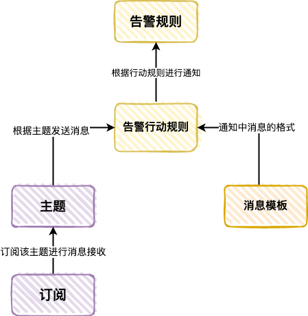
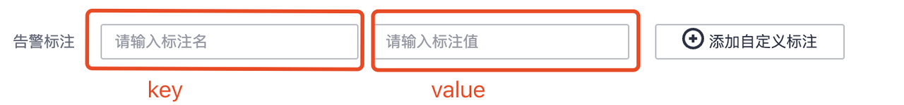
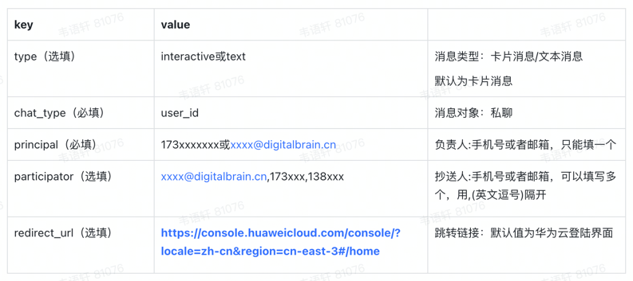
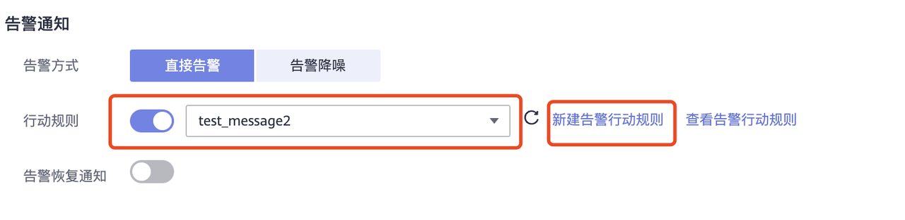
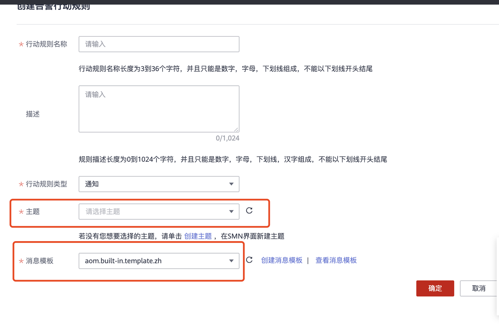
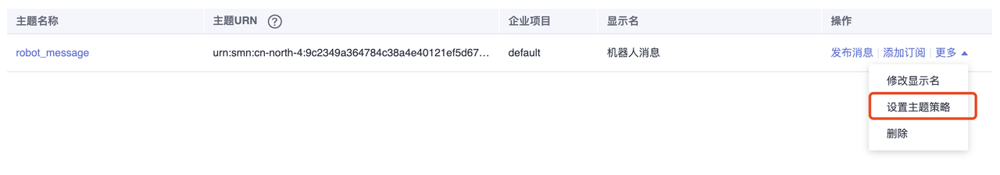
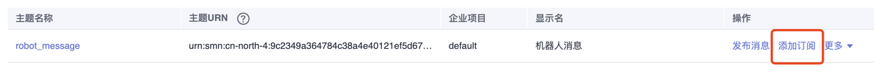
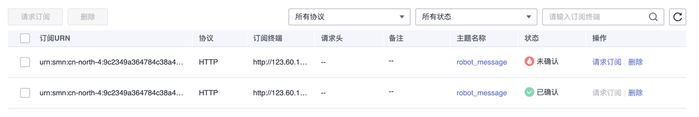
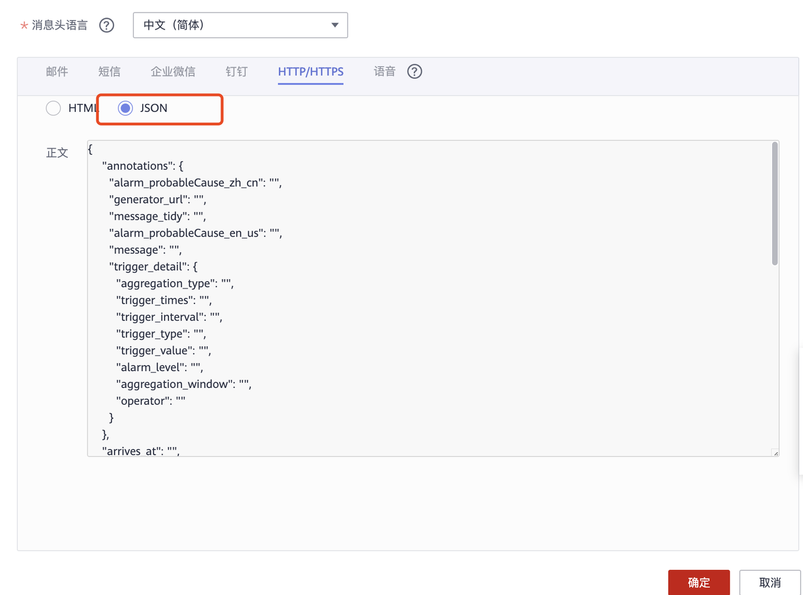

<div align="center">

# 🚨 huawei-alarm

### 华为云 AOM 告警 → 飞书机器人的 Webhook 通知桥

[](#-归档状态)
[](https://www.python.org)
[](https://fastapi.tiangolo.com)
[](https://www.postgresql.org)
[](https://open.feishu.cn)

**为飞书生态补齐"云监控告警机器人"同位能力:FastAPI 接收华为云 SMN 推送 → 解析告警 JSON → 落库审计 → 按注解分发到飞书群聊或私聊,支持 interactive 消息卡片。**

[数据流](#️-数据流) · [功能](#-核心能力) · [技术栈](#-技术栈) · [快速开始](#-快速开始) · [华为云配置](#-华为云侧配置指南) · [归档状态](#-归档状态)

</div>

---

## 📑 目录

- [项目概述](#-项目概述)
- [数据流](#️-数据流)
- [核心能力](#-核心能力)
- [技术栈](#-技术栈)
- [项目结构](#-项目结构)
- [快速开始](#-快速开始)
- [服务端配置](#-服务端配置)
- [华为云侧配置指南](#-华为云侧配置指南)
- [学习价值](#-学习价值)
- [已知限制](#️-已知限制)
- [归档状态](#-归档状态)
- [License](#-license)

---

## 📖 项目概述

`huawei-alarm` 是一个**华为云 AOM(Application Operations Management)告警 → 飞书(Lark)机器人**的 webhook 通知桥。部署形态是一个轻量的 FastAPI HTTP 服务,作为华为云 SMN(消息通知服务)消息模板中配置的 HTTP/HTTPS 订阅端点。

它解决的正是企业微信 / 钉钉告警机器人在飞书生态中的同位需求:**让云上的告警第一时间出现在团队群里,并@到该负责的人**。

| 维度 | 说明 |
| --- | --- |
| **产品形态** | 单接口 FastAPI 服务(`POST /message/send`) |
| **上游** | 华为云 AOM 告警 → SMN HTTP 订阅推送 |
| **下游** | 飞书 IM(群聊 / 私聊) |
| **持久化** | PostgreSQL `message_body` 表(审计 / 重放) |
| **代码体量** | 约 270 行(不含配置与文档),结构完整、依赖清晰 |

---

## 🏗️ 数据流

```
┌───────────────────┐   告警触发   ┌──────────────────┐
│  华为云 AOM        │ ─────────▶ │  SMN 消息通知服务   │
│  (阈值/事件规则)    │            │  (主题/订阅者)      │
└───────────────────┘            └────────┬─────────┘
                                          │ HTTP POST (JSON)
                                          ▼
┌─────────────────────────────────────────────────────────┐
│              FastAPI 服务(main.py → app/)                │
│                                                         │
│  ① 订阅确认:遇到 subscribe_url 字段 → 直接 GET 回执      │
│  ② 解析校验:Pydantic schema(MessageModel/MessageEvent)  │
│  ③ 落库审计:SQLAlchemy → PostgreSQL message_body 表     │
│  ④ 目标分发:                                            │
│     chat_type = chat_id → 群名匹配 chat_id → 群消息       │
│     chat_type = user_id → 邮箱/手机号 → user_id → 私聊    │
│  ⑤ 模板渲染:type = interactive/text → 消息卡片类族        │
└────────────────────────────┬────────────────────────────┘
                             │ 飞书 OpenAPI(tenant_access_token)
                             ▼
              ┌──────────────────────────────┐
              │   飞书 IM                     │
              │   群消息 / 用户私聊            │
              └──────────────────────────────┘
```

告警标题渲染为 `[严重级别]云服务器{资源提供方}通知:[{告警规则名}]告警规则`,内容渲染 `**可能原因**:{alarm_probableCause_zh_cn}`,并附带 `redirect_url` 跳转链接(默认跳华为云控制台)。

---

## ✨ 核心能力

| 模块 | 能力 |
| --- | --- |
| 📥 **SMN 接收** | `POST /message/send` 接收华为云 SMN 的 JSON 告警推送 |
| ✅ **订阅确认** | 识别 `subscribe_url` 字段,GET 回执完成 SMN 订阅验证 |
| 🔐 **鉴权缓存** | 飞书 `tenant_access_token` 全局缓存,30 分钟 TTL 过期检查 |
| 👥 **群聊分发** | 按告警标注中的群名查询飞书群列表(`im/v1/chats`),匹配后发送 |
| 🙋 **私聊分发** | 按 `principal` / `participator`(邮箱/手机号)批量查询通讯录获取 `user_id` |
| 🧱 **卡片模板** | 抽象基类 + `BaseTextMessage` / `UserAlarmInteractive` / `ChatAlarmInteractive` 三种卡片 |
| 💾 **落库审计** | 每条告警先写 PostgreSQL,支持事后审计与重放 |
| ⏱️ **时区处理** | 群消息用 UTC、私聊用 +8h 偏移的时间渲染 |

---

## 🧱 技术栈

| 类别 | 选型 | 用途 |
| --- | --- | --- |
| Web 框架 | FastAPI + Uvicorn | ASGI 服务、`APIRouter` 拆分、`reload` 热重载 |
| 校验 | Pydantic | 请求/响应 schema 与类型提示 |
| ORM | SQLAlchemy(`declarative_base` + `sessionmaker`) | `message_body` 表模型与 CRUD |
| 数据库 | PostgreSQL | 告警数据持久化(启动时 `create_all` 自动建表) |
| HTTP 客户端 | requests | 飞书 OpenAPI 调用 |
| 配置 | configparser + `lru_cache` 单例 | INI 双环境(`env` 切换 dev/prod) |

> 依赖未在锁定文件中固定版本;运行需 PostgreSQL 实例与可达飞书 OpenAPI 的网络环境。

---

## 📂 项目结构

```
huawei-alarm/
├── main.py                              # FastAPI 入口,mount /message 路由
├── config-dev.ini                       # 开发环境配置(凭证已脱敏)
├── config-prod.ini                      # 生产环境配置(凭证已脱敏)
├── README.md                            # 本文件
├── img/                                 # 华为云配置教程截图(9 张)
├── app/
│   ├── common/
│   │   ├── constants.py                 # 常量(chat_type / message_type / cache keys)
│   │   └── databases.py                 # SQLAlchemy engine + SessionLocal + get_db
│   ├── config/
│   │   ├── global_config.py             # ConfigSetting + GlobalConfig 单例
│   │   └── message_template_config.py   # 飞书消息卡片模板基类与实现
│   └── message/
│       ├── main.py                      # APIRouter + POST /message/send
│       ├── models.py                    # MessageBody ORM 模型 + build_message()
│       ├── schemas.py                   # Pydantic schema(MessageModel / MessageEvent)
│       ├── crud.py                      # 数据库 CRUD
│       └── service.py                   # 飞书 API 封装(token / 群列表 / 发送)
```

---

## 🚀 快速开始

> ⚠️ **归档快照**:仅供历史学习参考;运行前需在两份 INI 中填入真实凭证(见已知限制)。

```bash
# 1) 准备
pip install fastapi uvicorn sqlalchemy psycopg2 requests
# 准备 PostgreSQL 实例,并在飞书开放平台创建企业自建应用

# 2) 填写配置
#    编辑 config-dev.ini / config-prod.ini:
#    [robot]  app_id / app_secret(飞书应用凭证)
#    [pgsql]  host / port / dbname / user / passwd

# 3) 启动(uvicorn reload 模式)
uvicorn main:app --reload

# 4) 将服务公网地址填入华为云 SMN 的 HTTP 订阅端点
#    完整云侧配置见下方「华为云侧配置指南」
```

---

## ⚙️ 服务端配置

### [robot] 飞书机器人

| 配置项 | 说明 |
| --- | --- |
| `app_id` / `app_secret` | 飞书企业自建应用凭证 |
| `tenant_token_url` | 获取 `tenant_access_token` 的接口地址 |
| `chat_message_url` | 发送群消息(`receive_id_type=chat_id`) |
| `user_message_url` | 发送私聊(`receive_id_type=user_id`) |
| `chat_info_url` | 获取群组列表(群名 → chat_id 匹配) |
| `get_user_id_url` | 通讯录批量查询(邮箱/手机号 → user_id) |

### [pgsql] 数据库

| 配置项 | 说明 |
| --- | --- |
| `host` / `port` / `dbname` / `user` / `passwd` | PostgreSQL 连接信息 |
| `echo` | 是否打印 SQL 语句(布尔) |

---

## ☁️ 华为云侧配置指南

> 以下教程基于真实操作截图(`img/` 目录),可照抄完成华为云侧全部配置。

### 1. 告警规则概念

配置告警需要理解五个概念:**告警规则**(触发条件)→ **告警行动规则**(通知方式)→ **消息模板**(内容格式)→ **主题**(发布/订阅信道)→ **订阅者**(接收终端)。



### 2. 告警规则配置

基本信息与规则配置参考[华为云 AOM 官方文档](https://support.huaweicloud.com/usermanual-aom/aom_02_0062.html)。

**私聊功能 — 告警标注配置**(群名/收件人信息在告警标注中填写):





**告警通知配置** — 选择行动规则(无则新建):



### 3. 告警行动规则配置

行动规则中需特别注意主题与消息模板:



**主题配置** — 创建主题参考[华为云 SMN 官方文档](https://support.huaweicloud.com/usermanual-smn/zh-cn_topic_0043961401.html)。

**主题策略** — 参考[主题策略文档](https://support.huaweicloud.com/usermanual-smn/zh-cn_topic_0043394891.html)。⚠️ 「可发布消息的服务」必须选择 **APM**,否则通知会发送失败:



**添加订阅者** — 添加后 SMN 会向订阅终端发送确认信息(48 小时内有效,需及时确认):





### 4. 消息模板配置

HTTP/HTTPS 类型的消息模板**必须选择 JSON 格式**,否则服务收到的将是 HTML 模板:



HTTP 端点默认收到的 JSON 结构如下(`message` 字段内为本服务解析的告警体):

```json
{
    "signature": "...",
    "subject": "[重要]华为云AOM服务通知:...",
    "topic_urn": "urn:smn:cn-north-4:...",
    "message_id": "...",
    "signature_version": "v1",
    "type": "Notification",
    "message": "{...告警详情:annotations / metadata / policy / chat_id / chat_type ...}",
    "unsubscribe_url": "...",
    "signing_cert_url": "...",
    "timestamp": "2023-03-22T04:47:58Z"
}
```

---

## 💡 学习价值

- **云监控告警 → IM 通知的桥接模式**:订阅确认 + 消息解析 + 模板渲染 + 目标分发,四步拆解一个典型运维场景
- **SMN HTTP 订阅确认机制**:`subscribe_url` 字段的识别与回执
- **飞书 OpenAPI 集成全貌**:token 获取与缓存、群列表匹配、通讯录批量查询、两种 `receive_id_type` 的消息发送
- **Pydantic + SQLAlchemy 协同**:schema 校验 → ORM 构建 → CRUD 落库 → service 转发的分层数据流
- **工厂字典式动态分派**:`sent_message_factory`(`chat_id` → 群发,`user_id` → 私聊)替代 if-else 链
- **模板方法模式落点**:卡片消息的抽象基类 + 三种具体实现
- **FastAPI 最佳实践**:`Depends(get_db)` 会话注入、`APIRouter` 模块化、INI + `lru_cache` 配置单例

---

## ⚠️ 已知限制

| # | 问题 | 说明 |
| --- | --- | --- |
| 1 | 凭证为占位符 | `config-dev.ini` / `config-prod.ini` 中的 `app_id` / `app_secret` / `passwd` 已在归档脱敏为 `<YOUR_...>`,运行前需填入真实值 |
| 2 | 依赖未锁定版本 | 无 requirements.txt,按上方组件清单自行安装 |
| 3 | `config-prod.ini` 与 dev 内容一致 | 按生产规范应使用不同的实际凭证 |
| 4 | `aiohttp` 残留 import | 已引入但主流程未使用,异步化改造的未完成痕迹 |

---

## 🗄️ 归档状态

| 项 | 内容 |
| --- | --- |
| 原仓库 | `git@github.com:wychmod/huawei-alarm.git` |
| 归档日期 | 2026-06-28 |
| 导入方式 | 临时克隆脱敏(凭证替换为占位符)后 subtree 导入,归档 history 中不含真实凭证 |
| 当前状态 | **已归档,只读快照**,仅保留源码作为历史学习参考 |

详细档案(凭证脱敏清单、owner 后续动作建议)见 [`ARCHIVE.md`](./ARCHIVE.md)。

---

## 📜 License

原仓库未附带 LICENSE 文件。本项目仅用于学习与历史归档参考。
